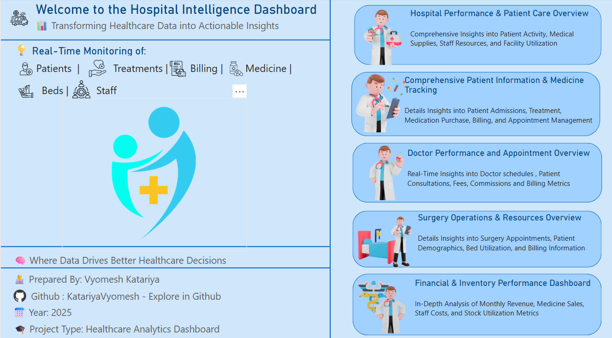
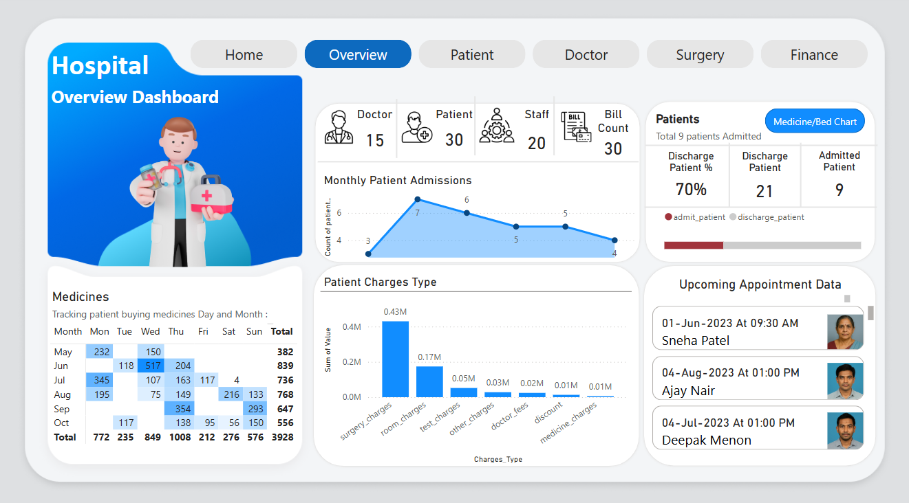
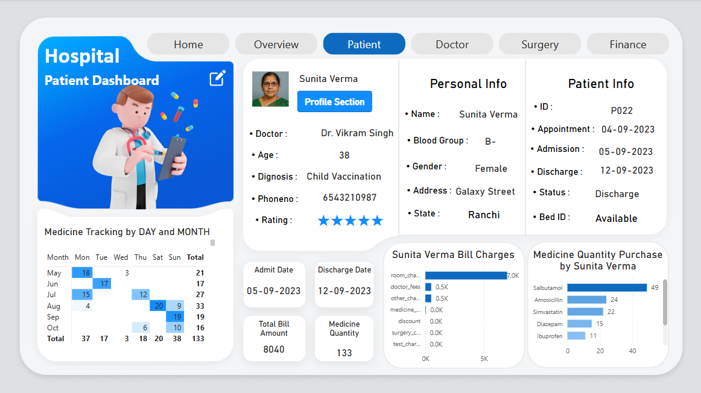
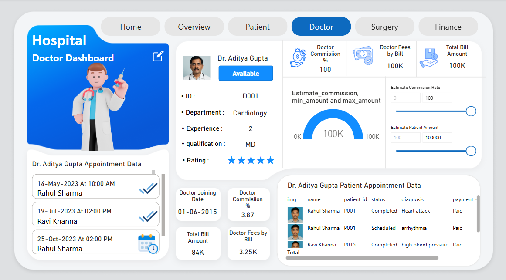
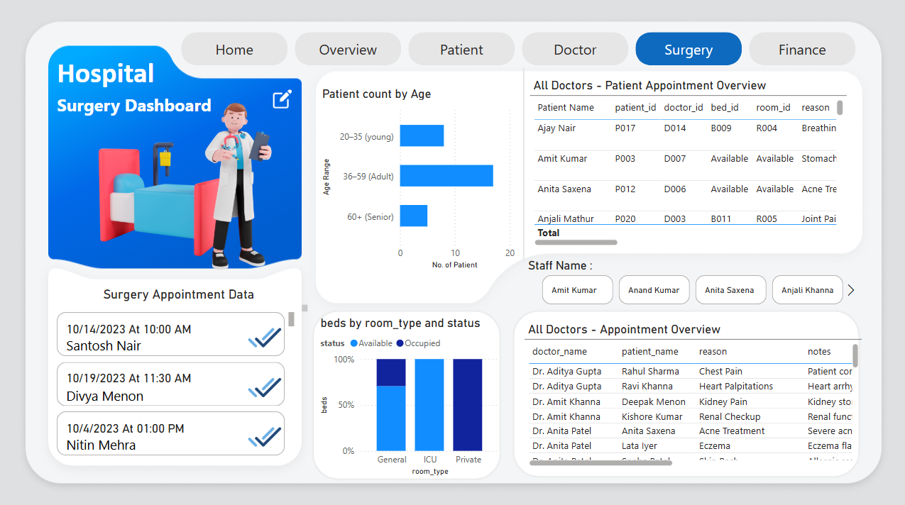
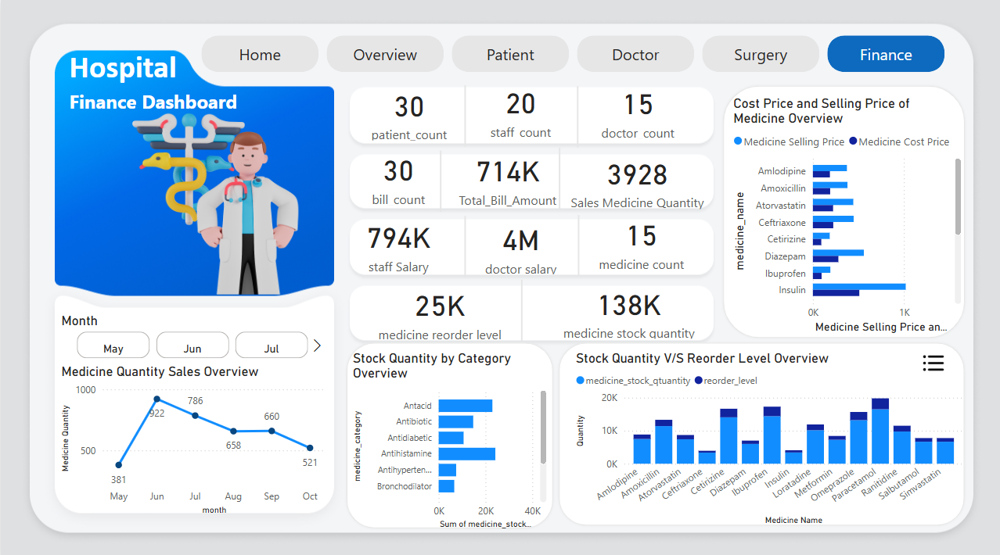

# 🏥 Hospital Intelligence Dashboard

A professional, end-to-end analytics solution that turns raw hospital data into crystal-clear insights.  
Built with **Power BI** (front-end), **SQL** (data mart), and **DAX** (business logic), the dashboard lets clinicians and administrators track quality of care, operational efficiency, and financial health in real-time.

---

## 📖 Table of Contents
1. [Project Overview](#project-overview)  
2. [Technology Stack](#technology-stack)  
3. [Screenshots](#screenshots)  
4. [Page-by-Page Feature Guide](#page-by-page-feature-guide)  
   - [Home Page](#home-page)  
   - [Overview Page](#overview-page)  
   - [Patient Page](#patient-page)  
   - [Doctor Page](#doctor-page)  
   - [Surgery Page](#surgery-page)  
   - [Finance Page](#finance-page)  
5. [Key DAX Measures – Hospital Power BI Dashboard](#dax-measures)  
6. [Key Metrics Tracked Across Pages](#key-metrics-tracked)  
7. [Setup & Deployment](#setup--deployment)  
8. [Author](#author)  
9. [License](#license)  

---

## Project Overview

> **Objective:** Build a single, unified dashboard that consolidates patient, clinical, inventory, and financial data—enabling faster, data-driven decisions and improved patient outcomes.

**Highlights**  
- ⚡ Real-time SQL refresh for up-to-the-minute KPIs  
- 🎛️ Intuitive slicers & bookmarks & pagination & Web URL for rapid filtering  
- 📈 Gauge, line, clustered/stacked bar and column chart, donut chart, metrics, tables, card (new),button silcer (new),list silcer (new) & 100% stacked column visuals
- 🔍 Drill-through into individual patients, doctors, surgeries, and SKUs( Stock Keeping Unit->SKUs typically refer to unique inventory items, especially medicines, medical equipment, or consumables.)

---

## Technology Stack

| Layer           | Tools / Frameworks       | Purpose                        |
|----------------|--------------------------|--------------------------------|
| **Data**       | SQL Server               | ETL, views, stored procs       |
| **Modeling**   | Power BI Data Model, DAX | Business logic & calculations  |
| **Visualization** | Power BI Desktop / Service | Interactive dashboards     |
| **Version Control** | Git + GitHub         | Source management & CI tracking|

---

## Screenshots

| Page     | Image                                   |
|----------|-----------------------------------------|
| Home     |                 |
| Overview |         |
| Patient  |           |
| Doctor   |             |
| Surgery  |           |
| Finance  |           |

---

## Page-by-Page Feature Guide
🏠
### Home Page

| **Section**              | **Description**                                                                                          |
|--------------------------|----------------------------------------------------------------------------------------------------------|
| **Hero Banner**          | A bold welcome message: _“Transforming Healthcare Data into Actionable Insights”_ with a subtitle that introduces the dashboard’s role in streamlining hospital analytics. |
| **Real-Time Monitoring KPIs** | Central live metrics covering **Patients**, **Treatments**, **Billing**, **Medicines**, **Beds**, **Staff**, **Appointments**, **Admissions**, and **Discharges**—powered by real-time SQL updates. |
| **Page Navigation**      | Transparent button-style navigation for quick access to: **Overview**, **Patient**, **Doctor**, **Surgery**, and **Finance** pages. |
| **Interactive Tiles**    | Clickable, icon-based tiles that intuitively guide users to detailed analytical views. |
| **Footer (Credits)**     | Developed by **Vyomesh Katariya** – [GitHub Profile »](https://github.com/KatariyaVyomesh) |

---

📊
### Overview Page

| **Feature / Control**             | **Description**                                                                                                                                                           |
|-----------------------------------|---------------------------------------------------------------------------------------------------------------------------------------------------------------------------|
| **Global KPI Cards**              | Real-time counts for **Doctors**, **Patients**, **Staff**, and **Bills**.                                                                                                 |
| **Bed & Medicine Dual Donut (Button-Driven)** | A transparent button labeled **“Medicine / Bed Chart”** toggles a pair of donut charts:<br>• **Bed Availability %** (Available vs Occupied)<br>• **Medicine Pricing Mix** (Cost vs Selling Price). |
| **Real-Time Medicine Purchase Metrics** | Dynamic metrics showing **daily** and **monthly** quantities of medicines purchased by patients, refreshed via DirectQuery.                                            |
| **Upcoming Appointments (Button Slicer “New”)** | A button-style slicer filters to **new / future appointments**, instantly updating all related visuals.                                                                |
| **Patient Charges Type**          | **Stacked column chart** breaking down charges (consultation, surgery, pharmacy, etc.) by patient type or department.                                                    |
| **Admissions vs Discharges**      | **Stacked bar chart** comparing counts of **Admission** and **Discharge** patients for the selected date range.                                                         |
| **Discharge KPIs**                | • **% Discharged** card (ratio of discharged to admitted patients).<br>• **Admission Count** and **Discharge Count** cards for absolute numbers.                         |
| **Operational Trend Line**        | **Line chart** showing **monthly admissions** across the fiscal year, highlighting peaks and troughs.                                                                    |
| **Resource Snapshot**             | Heat-map / table of active staff, available doctors, and resource utilization in real time.                                                                               |
| **Interactive Filters**           | Slicers for **Month**, **Department**, and **Doctor** ensure every visual reacts instantly to user selections.                                                            |


---


🧍
### Patient Page

A real-time, drill-through workspace that surfaces every key insight for an individual patient—clinical, financial, and experiential.

| **Section / Visual**               | **Purpose & Behaviour**                                                                                                              |
|------------------------------------|--------------------------------------------------------------------------------------------------------------------------------------|
| **Edit Button (Bookmark Slicer)**  | 🔖 **Top-left “Edit” button** reveals a button-style slicer listing all patient names.<br>• Selecting a patient forces the page to re-filter (“force quit”) and drives every dynamic title and visual on the page. |
| **Dynamic Page Title**             | 🏷️ Automatically changes to **“Patient Overview – _[Patient Name]_”** once a patient is selected. When no patient is selected, it falls back to **“Global Patient Overview”**. |
| **Patient Profile Cards**          | 📇 Personal details: Name · Age · Gender · Contact · Rating given to doctor (feedback).                                              |
| **Admission & Discharge Details**  | 📅 Cards show Admission Date, Discharge Date, and Length of Stay.                                                                     |
| **Medicine Tracking Metrics**      | 📈 Two metric cards—**Today’s Quantity** and **Month-to-Date Quantity**—refresh via DirectQuery to reflect real-time purchases.       |
| **Medicine Quantity (Clustered Bar)** | 💊 Displays, per medicine SKU, **quantity purchased by the selected patient**. Dynamic title: “Medicine Purchases by _[Patient Name]_”. |
| **Bill Charges (Clustered Bars ×2)** | 💳 Two clustered bar charts break down the patient’s **billable charges** by category (e.g., Consultation, Surgery, Pharmacy, Misc.). Separate views for absolute ₹ amount and % share. |
| **Financial KPI Cards**            | 💰 **Total Bill Amount** and **Total Medicine Quantity** for the selected patient.                                                    |
| **Real-Time Line Chart**           | ⏱️ Daily timeline of medicine purchases (day & month granularity) for live consumption monitoring.                                    |
| **Interactivity & Sync**           | • All visuals respond instantly to the edit-button slicer.<br>• Dynamic text titles use `SELECTEDVALUE()` to embed the patient name.<br>• Tooltips show additional context (doctor, time, SKU). |

> _Note:_ Each visual can be set to **Sort → Count / Amount → Descending** for quick high-to-low analysis.


---

🩺
###  Doctor Page

A real-time workspace that unifies schedule, performance, and financial metrics for each doctor.
| **Section / Visual**                           | **Purpose & Behaviour**      |
|------------------------------------------------|-------------------------------------------------------------------------------------------------------------------------------------------------------------------------------------------------------------------------------------------------------|
| **Edit Button (Bookmark Slicer)**              | 🔖 **Top-left “Edit” button** triggers a bookmark that slides in a **button-style slicer** containing every doctor’s **photo + name**.<br>— Selecting a doctor instantly re-filters the page to that profile.                                          |
| **Dynamic Page Title**                         | 🏷️ Automatically renders **“Doctor Dashboard – _[Doctor Name]_”** when a doctor is chosen; defaults to **“Overall Doctor Summary”** otherwise.                                                                                                       |
| **Doctor Profile Cards**                       | 🧑‍⚕️ **ID**, **Department**, **Years of Experience**, **Qualification**, **Joining Date**, and **Avg. Patient Rating ⭐**.                                                                                                                             |
| **Appointment Slicer**                         | 🎛️ Dedicated slicer lists each upcoming or historical **appointment** (<ins>Patient Name + Date/Time</ins>) with **status tags** (Scheduled / Completed) for rapid drill-in.                                                                           |
| **Financial Gauge**                            | 💸 Gauge visual powered by real-time DAX: **Doctor Commission % vs. Estimated Patient Amount**.                                                                                                                |
| **Financial Cards (Live)**                     | • **Doctor Commission %**<br>• **Doctor Fees by Bill**<br>• **Total Bill Amount** (all linked to the gauge for instant feedback).                                                                                                                     |
| **Contextual Cards (Patient-Scoped)**          | When an individual patient is selected via the slicer:<br>• **Doctor % Commission on Selected Patient Bill**<br>• **Selected Patient Total Bill**<br>• **Doctor Fees on Selected Patient Bill**.                                                      |
| **Doctor Appointment Table**                   | 📋 Image + details grid showing: Patient Photo | Name | Patient ID | Status | Diagnosis | Payment Status | Doctor Fees.                                                                                        |
| **Performance KPIs**                           | Cards for **Total Appointments**, **Patients Treated**, **Total Revenue Generated**, **Estimated Commission Earned**.                                                                                                                                |
| **Live Metrics (DirectQuery)**                 | SQL-driven cards recalculating fees, commissions, and bill totals every refresh cycle.                                                                                                                         |

> _Note:_ **All dynamic titles use `SELECTEDVALUE()` DAX to reflect the active doctor name.**  
> Combine the bookmark slicer with “Sync Slicers” in Power BI so the selected doctor context travels across related report pages.


---

🏥
###  Surgery Page

An interactive view that consolidates surgical appointments, resource utilisation, and financial details—dynamically filtered to any selected surgeon.

| **Section / Visual**                           | **Purpose & Behaviour**                                                                                                                                                                                                                             |
|------------------------------------------------|-------------------------------------------------------------------------------------------------------------------------------------------------------------------------------------------------------------------------------------------------------|
| **Edit Button (Bookmark Slicer)**              | 🔖 **Top-left “Edit” button** reveals a button-style slicer containing every surgeon’s **photo + name**. Selecting a surgeon instantly re-filters **all** visuals and cards on the page.                                                             |
| **Dynamic Page & Visual Titles**               | 🏷️ All major titles use `SELECTEDVALUE()` DAX, e.g. **“Surgery Dashboard – _[Doctor Name]_”**. When no surgeon is chosen, titles fall back to a neutral label (e.g., “All Surgeons”).                                                                 |
| **Surgery Appointment Snapshot (Cards)**       | 📅 Real-time count of **today’s surgeries** and next **upcoming surgery time** for the selected doctor.                                                                                                         |
| **Doctor Appointment Table (Table 1)**         | 📋 Lists **Doctor Name · Patient Name · Reason · Note · Description · Surgery Appt. Date/Time · Status**. Driven by the bookmark slicer; shows only rows for the chosen surgeon.                                                                     |
| **Patient-Level Surgery Details (Table 2)**    | 🗂️ Displays **Patient Name · Patient ID · Bed ID · Room ID · Doctor ID · Reason · Note · Description · Payment Method · Surgery Fees · Discount · Final Fees · Appt. Date/Time · Status Image (Web URL)**—fully scoped to the selected surgeon. |
| **Age Group Distribution**                     | 👥 **Clustered Bar Chart** that groups patients into **Young (20–35)**, **Adult (36–59)**, **Senior (60+)** counts for the active doctor.                                                                      |
| **Bed Utilisation by Room Type**               | 🛏️ **100 % Stacked Column Chart** showing **Beds by Room Type** split by **Status (Available vs Occupied)** for quick capacity checks.                                                                        |
| **Staff Slicer (Dynamic)**                     | 🎚️ A slicer for **Staff Name** that filters both tables and adjusts all card totals—ideal for team performance reviews.                                                                                       |
| **Performance & Financial KPI Cards**          | 💸 Cards for **Total Surgeries**, **Total Surgical Revenue**, **Average Surgery Discount**, and **Avg. Length of Stay**—all reactive to surgeon and staff selections.                                         |

> _Note:_ **Every dynamic title and subtitle leverages `SELECTEDVALUE()` DAX** to display the active doctor’s name.  

---

💰
###  Finance Page


The **Finance Page** provides an interactive and real-time overview of the hospital's financial operations, including billing, stock, patient charges, and revenue trends.

> _Note:_ All visuals in this page are fully **dynamic** and respond to:
> - **Month Slicer** (for tracking performance month-wise)
> - **Edit Button Bookmark – Medicine** (filters all data based on selected medicine)

| **Section / Visual**                    | **Purpose & Behaviour**                                                                                                                                                   |
|----------------------------------------|---------------------------------------------------------------------------------------------------------------------------------------------------------------------------|
| **Edit Button (Bookmark – Medicine)**  | 📌 Opens a dynamic button slicer listing **all medicine names**. Once selected, it filters the entire page to show medicine-specific insights.                            |
| **Dynamic Titles**                     | 🏷️ Every chart and section uses `SELECTEDVALUE()` in DAX to display the currently selected **month** or **medicine** in the title.                                         |
| **Month Slicer**                       | 📅 Allows filtering all data on the page by a selected **billing month**, enabling clear month-over-month comparisons.                                                    |
| **Real-Time Sales Tracking**           | 📈 **Line Chart** showing the **monthly trend** of medicines purchased by patients.                                                                                        |
| **Financial Summary (Cards)**          | 💳 Cards show key metrics: **Total Bill Amount**, **Staff Salary**, **Bill Count**, **Patient Count**, **Doctor Count**, **Staff Count**.                                |
| **Inventory KPIs (Cards)**             | 📦 Cards summarizing stock status: **Total Medicine Count**, **Reorder Count**, and **Total Stock Quantity**.                                                             |
| **Stock vs Reorder Level**             | 🧾 **Stacked Column Chart** compares the **available stock** vs. **reorder level** for each medicine, highlighting over- and under-stocked items.                          |
| **Charge Type Distribution**           | 📐 **Stacked Column Chart** categorizes **patient charges** (Consultation, Medicine, Surgery, etc.) by type for cost analysis.                                            |
| **Admission vs. Discharge Trends**     | 📊 **Stacked Bar Chart** comparing **monthly admission and discharge counts**. Complemented with cards displaying: **Total Admitted**, **Total Discharged**, and **% Discharged**. |
| **Upcoming Appointments (Slicer - New)**| 📅 **Button slicer** to filter and view **upcoming appointment data** for patients dynamically.                                                                            |
| **Stock by Category**                  | 📊 **Stacked Bar Chart** shows stock quantity per **medicine category**, useful for inventory planning and category-level decisions.                                      |
| **Monthly Admission Trend**            | 📈 **Line Chart** visualizing **monthly admission counts**, assisting in capacity and operational planning.                                                               |

This page acts as the financial backbone of the dashboard, allowing admins and finance teams to monitor every essential metric in a single glance.


---

📊
## Key DAX Measures – Hospital Power BI Dashboard

This section outlines all important DAX measures used across pages of the hospital management dashboard. These help drive KPIs, track performance, and add dynamic behavior to visuals.

---

### 🧪 Medicine Metrics

| #  | **Measure Name**              | **Purpose**                                             |
|----|-------------------------------|---------------------------------------------------------|
| 1  | `Medicine Quantity`           | Total quantity sold / dispensed                        |
| 2  | `Medicine Count`              | Unique medicine types in stock                         |

---

### 👨‍⚕️ Doctor Metrics

| #  | **Measure Name**              | **Purpose**                                             |
|----|-------------------------------|---------------------------------------------------------|
| 1  | `Doctor Count`                | Total active doctors                                   |
| 2  | `Sum of Rating (⭐)`          | Average star rating by doctor                          |
| 3  | `Doctor Commission %`         | Commission percentage based on fees                    |
| 4  | `Estimate Doctor Commission`  | Forecasted commission based on bill amount             |
| 5  | `Doctor Status`               | Status – Active or Inactive                            |
| 6  | `Dynamic Doctor Appointment`  | Sliced appointment table                               |
| 7  | `Dynamic Doctor-Patient Appt.`| Patient list filtered by selected doctor               |

---

### 💰 Billing & Financial Metrics

| #  | **Measure Name**              | **Purpose**                                             |
|----|-------------------------------|---------------------------------------------------------|
| 1  | `Total Bill Amount`           | Overall billing (per patient/month)                    |
| 2  | `Max Amount`                  | Highest bill recorded                                  |
| 3  | `Bill Count`                  | Number of invoices generated                           |
| 4  | `Total Fees by Patient`       | Aggregated consultation/treatment fees per patient     |

---

### 🛏️ Bed & Room Occupancy Metrics

| #  | **Measure Name**              | **Purpose**                                             |
|----|-------------------------------|---------------------------------------------------------|
| 1  | `Bed Occupied Target KPI`     | Target = Previous Month + 5%                           |
| 2  | `Bed Occupied Selected Month` | Current month's occupancy                              |
| 3  | `Bed Occupied Trend`          | Occupancy trend over time                              |

---

### 🧍 Patient Metrics

| #  | **Measure Name**              | **Purpose**                                             |
|----|-------------------------------|---------------------------------------------------------|
| 1  | `Patient Count`               | Unique patients                                         |
| 2  | `Total Admission`             | Patient admissions                                     |
| 3  | `Dynamic Surgery Appointment` | Appointments filtered by selected surgeon              |

---

### 📈 Additional Metrics for Dynamic Pages

| #  | **Measure Name**              | **Purpose**                                             |
|----|-------------------------------|---------------------------------------------------------|
| 1  | `Max Rate`                    | Highest rating achieved                                |
| 2  | `Staff Count`                 | Total staff available                                  |

---


---

📌
## Key Metrics Tracked Across Pages

This dashboard tracks a comprehensive set of live and historical metrics to provide real-time operational visibility into hospital performance:

| **Metric**                                 | **Description**                                                                                           | **Pages**                                   |
|--------------------------------------------|-----------------------------------------------------------------------------------------------------------|----------------------------------------------|
| **🧑‍⚕️ Doctor Count**                        | Total number of registered doctors.                                                                      | Home, Overview, Finance                      |
| **🧑 Patient Count**                        | Total patients admitted or recorded in the hospital system.                                               | Home, Overview, Patient, Finance             |
| **💉 Staff Count**                          | Total active staff members working in the hospital.                                                       | Home, Overview, Finance                      |
| **🧾 Bill Count**                           | Total number of bills generated.                                                                          | Home, Overview, Finance                      |
| **💊 Medicine Count**                       | Total distinct medicines in stock.                                                                        | Overview, Finance                            |
| **📦 Total Stock Quantity**                | Current available stock of all medicines combined.                                                        | Finance                                      |
| **⚠️ Reorder Count**                        | Medicines that have reached or fallen below the reorder threshold.                                        | Finance                                      |
| **🏥 Total Beds / Bed Availability %**     | Number and percentage of beds available vs. occupied.                                                     | Overview, Surgery                            |
| **📆 Total Appointments**                  | Count of total scheduled or completed appointments.                                                       | Home, Overview, Doctor, Finance              |
| **🗓️ Upcoming Appointments**               | Appointments scheduled for the future.                                                                    | Overview, Finance                            |
| **📈 Monthly Admissions Trend**            | Line chart showing how patient admissions vary month-over-month.                                          | Overview, Finance                            |
| **📉 Discharge Count & % Discharged**      | Number and percentage of patients discharged.                                                             | Overview, Finance                            |
| **📈 Real-Time Medicine Purchases**        | Quantity of medicines purchased by patients (day-wise and month-wise).                                    | Overview, Patient                            |
| **💰 Total Bill Amount (Per Patient/Doctor)** | Overall billing per patient or generated via a particular doctor.                                         | Patient, Doctor, Finance                     |
| **💳 Doctor Commission %**                | Commission earned by a doctor based on billed amount.                                                     | Doctor                                       |
| **📊 Charges Breakdown by Type**          | Stacked column chart of Consultation, Pharmacy, Surgery, etc. charges.                                    | Overview, Patient, Finance                   |
| **🏨 Room Type vs Bed Status**             | Bed distribution by room category and availability status.                                                | Surgery                                      |
| **👨‍👩‍👧‍👦 Patient Age Distribution**         | Clustered bar chart to show patient demographics (Young, Adult, Senior).                                  | Surgery                                      |
| **📋 Appointment Summary Table**          | Patient-wise or doctor-wise detailed appointments and billing breakdowns.                                 | Patient, Doctor, Surgery                     |
| **⭐ Doctor Rating (Patient Feedback)**    | Patient-given rating to doctors based on satisfaction or behavior.                                        | Patient, Doctor                              |
| **📉 Discount on Surgery Bills**          | Calculated discount and final surgery fees post-discount.                                                 | Surgery                                      |
| **📅 Staff-wise Filtering & Performance** | Filter visuals based on staff members to see related metrics and tables.                                  | Surgery                                      |
 

---

## Setup & Deployment

```bash
# 1. Clone the repository
git clone https://github.com/vyomeshkatariya/hospital-intelligence-dashboard.git
cd hospital-intelligence-dashboard

# 2. Open Power BI
#    - Load the .pbix file
#    - Set up your SQL connection (if required)
#    - Replace relative paths for images with Power BI Web URLs or base64-encoded images

# 3. Optional
#    - Publish to Power BI Service for auto-refresh setup
#    - Adjust bookmarks/slicers for user-specific roles
